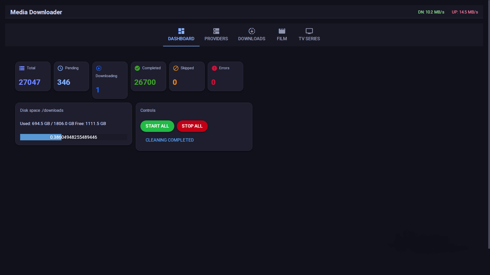
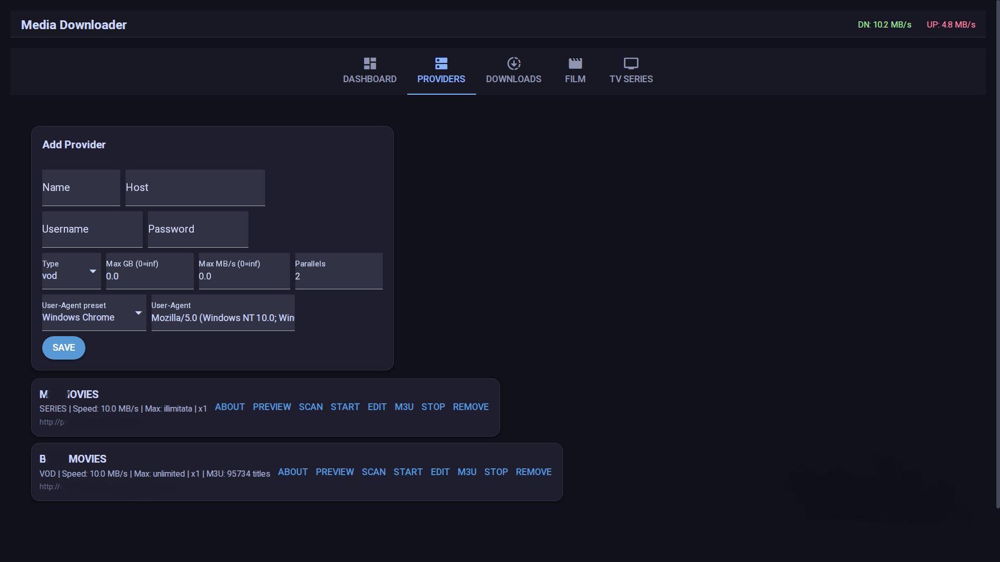

# Media Downloader

Self-hosted Python + NiceGUI web application for downloading and managing VOD and Series content from Xtream API providers.

## Features

* Xtream Codes API support
* Mass VOD and Series downloads
* Concurrent downloads
* Queue manager
* Realtime dashboard
* M3U compare/skip support
* Download speed limiting
* Custom User-Agent support
* Self-hosted web interface

## Screenshots


<br>


---

## Requirements

Recommended:

* 4 CPU cores
* 4 GB RAM

Minimum:

* Python 3.11+
* Linux server / VPS

---

## Installation

```bash
sudo apt update
sudo apt install -y python3-venv

mkdir md && cd md

python3 -m venv env
source env/bin/activate
```

## Dependencies

```bash
pip install sqlmodel
pip install aiohttp
pip install aiofiles
pip install tqdm
pip install nicegui
```

Or:

```bash
pip install -r requirements.txt
```

---

## Usage

```bash
python main.py
```

Default web UI:

```text
http://SERVER_IP:8080
```

---

## Notes

This project is intended for educational and personal use only.

Users are responsible for complying with their local laws and content provider terms of service.

---

## Contributing

Contributions, improvements, bug reports and pull requests are welcome.

Feel free to fork the project and improve it.

---

## License

MIT License
